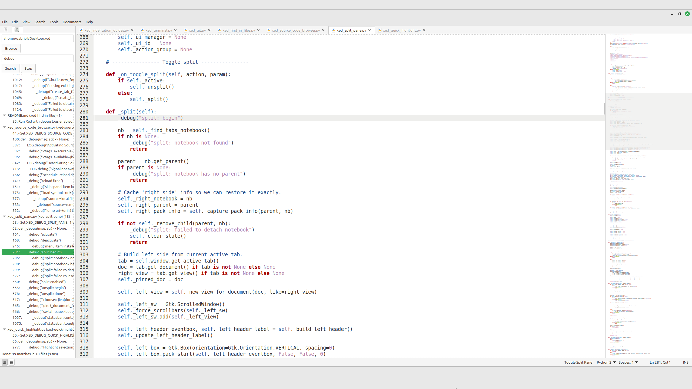

# xed-find-in-files

**Find in Files** for **Xed (Linux Mint)** — searches occurrences of an expression inside all files from a folder.

## Features
- Side panel tab with:
  - Folder picker (Browse)
  - Search entry (Enter triggers search)
  - **Search** and **Stop** buttons (text only)
- Results grouped by file (TreeView):
  - Root: `main.c (src/utils) (12)`
  - Children: `123: matched line content`
- Click / Enter on a match opens the file and jumps to the line (reuses an already-open tab)
- Expand/collapse file nodes with double-click (TreeView default behavior)
- Ignores:
  - Hidden files and folders (`.*`)
  - Folders that contain a `.gitignore` file
- Performance-focused:
  - Search runs in a **background thread** (keeps Xed responsive)
  - UI updates are applied in **batches** (100 matches per batch)
  - Hard limit of **5000** matches per search
  - **Stop** cancels the current search

## How it works
- The plugin searches inside the selected folder using one of two backends:
  - **ripgrep (`rg`)** if available **and enabled in preferences**
  - **Python fallback** otherwise (handles encoding/binary files defensively)
- Matches are streamed back to the UI in batches and grouped by file.
- Activating a match opens the file (or focuses an existing tab) and scrolls to the target line.

## Usage
1. Enable the plugin (see Install).
2. Open the **Find in Files** tab in the Xed side panel.
3. Choose a folder (Browse) and type the expression.
4. Press **Enter** or click **Search**.
5. Click a match (or press **Enter** on a selected match) to jump to it.
6. Use **Stop** to cancel a long search.

## Preferences
Open **Edit → Preferences → Plugins → Xed Find in Files → Configure**.

Settings are stored in:
`~/.config/xed-find-in-files/config.ini`

Key options (defaults):
- `use_rg_if_available`: `true`
- `expand_results_by_default`: `true`

## Install

### Dependencies (Linux Mint / Ubuntu / Debian)
- Xed with Python (GI) plugin support (default on Linux Mint)
- Optional (recommended): **ripgrep** (`rg`) for faster searching
- Optional: **git** (used to improve enumeration in git repos when available)

Install ripgrep:
```bash
sudo apt update
sudo apt install -y ripgrep
```

Verify:
```bash
rg --version
```

### Copy folder
```bash
mkdir -p ~/.local/share/xed/plugins/
cp -r xed-find-in-files ~/.local/share/xed/plugins/
```

### Restart Xed and enable the plugin
**Edit → Preferences → Plugins → Xed Find in Files**

## Troubleshooting
- If `rg` is installed but not being used:
  - Check **Preferences → Plugins → Xed Find in Files → Configure**
  - Ensure **Use ripgrep (rg) if available** is enabled
- If results look incomplete:
  - The plugin ignores hidden paths (`.*`) and folders containing `.gitignore`
  - The search also stops at **5000** matches by design

## Debug
Run Xed with debug logs enabled:
```bash
XED_DEBUG_FIND_IN_FILES=1 xed
```

## Credits
- Xed Find in Files plugin by **Gabriell Araujo (2026)**.

## License
**GPL-2.0-or-later**

## Screenshots

### xed-find-in-files

